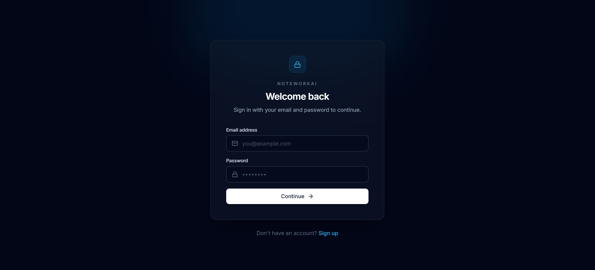
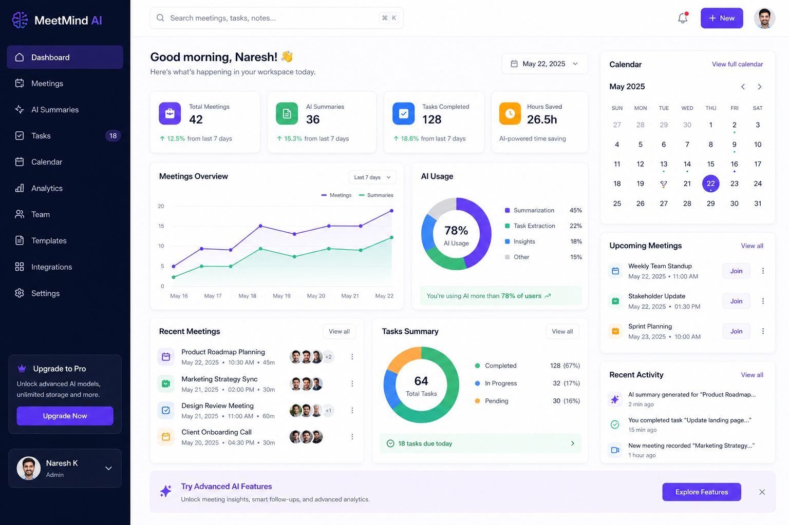

# 📝 NoteWorkAI

**NoteWorkAI** is an AI-powered productivity platform that helps users organize notes, manage tasks, and manage their schedules more efficiently. Powered by **Google Gemini AI**, it transforms raw notes into actionable insights, automatically extracts tasks, and seamlessly synchronizes events with **Google Calendar** through two-way synchronization.

Designed with a modern MERN stack architecture, NoteWorkAI combines AI-assisted productivity, secure authentication, calendar management, and cloud-based media handling into a single intuitive platform.

---

# ✨ Features

* 🤖 AI-powered note summarization
* ✅ Intelligent task extraction and management
* 📅 Two-way Google Calendar synchronization
* 📝 Smart note organization
* 📊 Productivity dashboard
* 👤 Secure user authentication
* ☁️ Cloud-based avatar management
* 📱 Fully responsive modern interface

---

# 🛠 Tech Stack

## Frontend

* React
* TypeScript
* Tailwind CSS
* React Router
* React Hook Form
* TanStack Query

## Backend

* Node.js
* Express.js
* MongoDB
* JWT Authentication

## AI & Cloud Services

* Google Gemini API
* Google Calendar API
* Cloudinary

---

# ⚙️ Environment Variables

Create the required `.env` file inside the backend directory before running the project.

## Backend (`backend/.env`)

```env
PORT=5000

MONGO_URI=mongodb+srv://<user>:<password>@cluster.mongodb.net/noteworkai

JWT_SECRET=your_super_secure_access_token_secret
JWT_REFRESH_SECRET=your_super_secure_refresh_token_secret

CLIENT_URL=http://localhost:5173

GEMINI_API_KEY=your_google_gemini_api_key

GOOGLE_CLIENT_ID=your_google_client_id
GOOGLE_CLIENT_SECRET=your_google_client_secret
GOOGLE_REDIRECT_URI=your_google_redirect_uri

CLOUDINARY_CLOUD_NAME=your_cloud_name
CLOUDINARY_API_KEY=your_api_key
CLOUDINARY_API_SECRET=your_api_secret
```

---

# 🛡️ Security Features

NoteWorkAI follows modern web security practices suitable for handling personal notes, tasks, and calendar information.

### Helmet

Automatically configures secure HTTP headers to defend against common web vulnerabilities such as clickjacking and MIME-sniffing.

### CORS Protection

Only trusted frontend origins are allowed to communicate with the backend through carefully configured Cross-Origin Resource Sharing policies.

### Rate Limiting

Global and endpoint-specific rate limiting protects authentication endpoints against brute-force attacks and helps mitigate DDoS attempts.

### Secure Authentication

Refresh tokens are stored inside **HttpOnly**, **SameSite=Strict**, and **Secure** cookies (production), preventing JavaScript access.

### JWT Authorization

Protected APIs require valid Bearer Tokens verified using custom authentication middleware.

### Upload Validation

Avatar uploads are validated for MIME type and file size before processing to prevent malicious uploads.

### Role-Based Access Control

Protected routes verify authenticated users before granting access to resources.

---

# 🧠 AI Workflow System

The core of NoteWorkAI is powered by **Google Gemini AI**, enabling intelligent productivity automation.

### Note Processing

Raw notes entered by users are cleaned, structured, and prepared for AI analysis.

### Contextual Understanding

Gemini AI analyzes the content to understand context, identify important information, and determine the desired output.

### AI Summary Generation

Long notes are transformed into concise summaries highlighting the most important information.

### Smart Task Extraction

Action items are automatically detected and converted into structured tasks that can be managed inside the application.

### AI Productivity Assistant

The AI helps users quickly organize information, reduce manual effort, and improve overall productivity.

---

# 📅 Google Calendar Integration

NoteWorkAI provides seamless Google Calendar integration.

### Features

* OAuth 2.0 Authentication
* Create Calendar Events
* Update Existing Events
* Delete Events
* **Two-way Google Calendar Synchronization**
* Automatic Event Sync
* Secure Token Management

---

# 👤 Avatar Management

The platform supports modern profile management.

* Drag-and-drop avatar uploads
* Cloudinary image hosting
* External avatar URLs (Google Account)
* Instant avatar synchronization throughout the application

---

# ⚡ Performance Optimizations

### MongoDB Indexing

Strategic indexes improve database query performance.

### Connection Pooling

Efficient MongoDB connection management reduces latency and improves scalability.

### Client-side Caching

React Query minimizes unnecessary API requests while keeping application data fresh.

### Lazy Loading

Large components are dynamically imported to improve initial page loading performance.

### Optimized Asset Delivery

Images are served through Cloudinary's optimized CDN.

---

# 🚀 Deployment

The application is designed for production deployment.

## Frontend

* Vercel

## Backend

* Render
* Railway

## Database

* MongoDB Atlas

## Media Storage

* Cloudinary

Production deployments enforce HTTPS, secure cookies, optimized CORS policies, and environment-based configuration.

---

# 📸 Screenshots

Add your application screenshots here.

Example:

## 📸 Screenshots

### Login


### Dashboard


### Tasks


### Calendar


# 🔮 Future Improvements

* 🎙️ Real-time Speech-to-Text Meeting Transcription
* 📧 AI-generated Email Drafts
* 🔔 Push and Email Notifications
* ⚡ Redis Caching
* 👥 Team Collaboration Workspaces
* 🧠 AI Memory System using Vector Databases
* 📱 Mobile Application
* 📈 Advanced Productivity Analytics

---

# 💻 Installation

Clone the repository

```bash
git clone https://github.com/semuhammadawais/NoteWorkAI.git
```

Install dependencies

```bash
npm install
```

Start the development server

```bash
npm run dev
```

---

# 📄 License

This project is developed for educational, research, and portfolio purposes.

---

# 👨‍💻 Author

**Muhammad Awais**

GitHub: https://github.com/semuhammadawais
